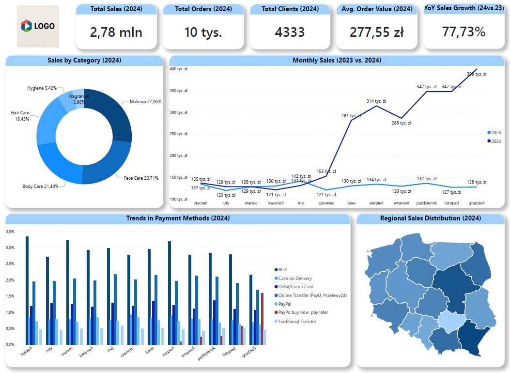

# data-analysis-sql-portfolio
SQL queries for data analysis – part of my data analyst portfolio.

**ENGLISH BELOW**

# Analiza Sprzedaży – Drogeria Internetowa (wersja polska)

Projekt analizy sprzedaży dla fikcyjnej drogerii internetowej działającej na terenie całej Polski. Celem było stworzenie kompleksowej bazy danych, wykonanie zapytań SQL, a także wizualizacja danych w formie interaktywnego dashboardu na podstawie przeprowadzonej analizy.

Dane obejmują lata 2023 i 2024 i zostały wygenerowane z pomocą AI (ChatGPT), a następnie rozbudowane ręcznie przez autora. Dane fikcyjne.

---

## Struktura bazy danych

Baza danych została zaprojektowana w PostgreSQL i zawiera następujące tabele:

- `regions`
- `customers`
- `products`
- `orders`
- `order_details`

Diagram ERD znajduje się w folderze `img/`.

---

## Technologie i narzędzia

- **PostgreSQL** – relacyjna baza danych, przechowywanie i przetwarzanie danych  
- **SQL** – tworzenie zapytań analitycznych i przetwarzanie danych sprzedażowych  
- **Power BI** – dashboard interaktywny i końcowa prezentacja wyników analizy  
- **PyCharm** – środowisko pracy z danymi i zarządzania kodem  
- **AI (ChatGPT, generatory obrazów)** – wsparcie przy generowaniu danych do bazy oraz przykładowego logo firmy  
- **CSV** – format danych źródłowych  

---

## Struktura folderów

- `sql/` – zapytania SQL  
- `data/` – dane źródłowe CSV  
- `img/` – dashboard Power BI, schemat ERD, logo
- `README.md` – opis projektu  

---

## Podsumowanie analizy sprzedaży

### Wnioski:

- **Dynamiczny wzrost sprzedaży** – Łączna wartość sprzedaży w 2024 roku wyniosła 2,78 mln zł, co stanowi wzrost o 77,73% względem 2023 r.
- **Sezonowość** – Wzrost sprzedaży od czerwca z kulminacją w grudniu (396 tys. zł), wskazuje na skuteczne działania marketingowe.
- **Kategorie produktów** – Największy udział mają Makeup (27,06%) i Face Care (23,71%). Najniższy: Fragrances i Hygiene.
- **Metody płatności** – Dominują BLIK, karty i szybkie przelewy. Odroczone płatności zyskują na popularności od wprowadzenia takiej możliwości.
- **Zróżnicowanie regionalne** – Największa sprzedaż: woj. podkarpackie i mazowieckie. Najmniejsza: świętokrzyskie i śląskie.

### Rekomendacje:

- Monitorować I kwartał 2025 – czy wzrostowy trend się utrzyma.
- Kontynuować rozwój kategorii Makeup i Face Care, ale wspierać Fragrances kampaniami promocyjnymi.
- Rozwijać metody płatności online – szczególnie BLIK i przelewy błyskawiczne oraz dynamiczniej rozwijające się płatności odroczone.
- Wykorzystać wysoką średnią wartość koszyka (277,55 zł) do kampanii retencyjnych i cross-sellingowych.

---

## Autor

Projekt stworzony w ramach nauki analizy danych i BI. Dane i dashboard mają charakter edukacyjny.

---

## Źródła / Podziękowania

Do stworzenia wizualizacji mapy regionalnej w Power BI wykorzystano plik TopoJSON przedstawiający granice województw Polski, pobrany z serwisu [SimpleMaps](https://simplemaps.com/gis/country/pl).

---

## Licencja

Projekt dostępny na licencji MIT.  
Dane mają charakter edukacyjny i nie przedstawiają rzeczywistych transakcji.

---
---

# Sales Analysis – Online Cosmetics Store (English version)

The sales analysis project for a fictional online cosmetics store operating throughout Poland. The goal was to create a comprehensive database, write SQL queries, and visualize the data through an interactive dashboard based on the analysis performed.

The data covers the years 2023 and 2024 and was generated with the help of AI (ChatGPT) and then manually expanded by the author. The data is fictional.

---

## Database Structure

The database was designed in PostgreSQL and includes the following tables:

- `regions`
- `customers`
- `products`
- `orders`
- `order_details`

The ERD diagram can be found in the `img/` folder.

---

## Technologies and Tools

- **PostgreSQL** – relational database for storing and processing data  
- **SQL** – writing analytical queries and processing sales data  
- **Power BI** – interactive dashboard and final presentation of analysis results  
- **PyCharm** – data workspace and code management environment  
- **AI (ChatGPT, image generators)** – support in generating database data and sample company logo  
- **CSV** – source data format  

---

## Folder Structure

- `sql/` – SQL queries  
- `data/` – source CSV data  
- `img/` – Power BI dashboard, ERD schema, logo  
- `README.md` – project description  

---

## Sales Analysis Summary

### Conclusions:

- **Dynamic sales growth** – The total sales value in 2024 amounted to 2.78 million PLN, which is a 77.73% increase compared to 2023.
- **Seasonality** – Sales growth from June, peaking in December (396k PLN), indicates effective marketing activities.
- **Product categories** – Largest shares: Makeup (27.06%) and Face Care (23.71%). Lowest: Fragrances and Hygiene.
- **Payment methods** – BLIK, cards, and instant bank transfers dominate. Deferred payments have been gaining popularity since their introduction.
- **Regional diversity** – Highest sales: Podkarpackie and Mazowieckie voivodeships. Lowest: Świętokrzyskie and Śląskie.

### Recommendations:

- Monitor Q1 2025 – to check if the upward trend continues.
- Continue developing Makeup and Face Care categories, but support Fragrances with promotional campaigns.
- Develop online payment methods—especially BLIK and instant bank transfers—as well as the rapidly growing buy now, pay later options.
- Use the high average basket value (277.55 PLN) for retention and cross-selling campaigns.

---

## Author

The project was created as part of learning data analysis and BI. The data and dashboard are for educational purposes.

---

## Sources / Acknowledgements

The regional map visualization in Power BI used a TopoJSON file showing Polish voivodeship borders, downloaded from [SimpleMaps](https://simplemaps.com/gis/country/pl).

---

## License

The project is available under the MIT license.  
The data is educational and does not represent actual transactions.

